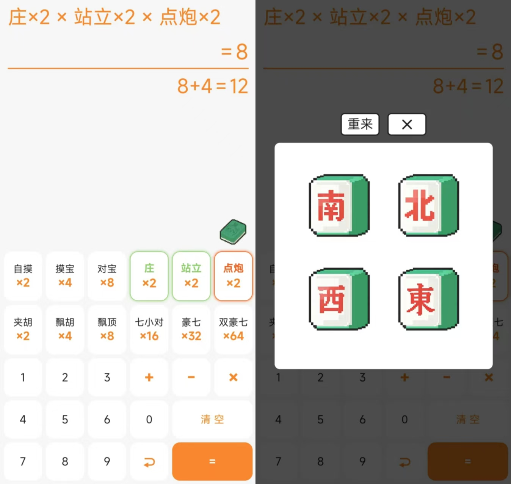

# 🀄 长春麻将计分器

一个基于 Vue 3 开发的长春麻将番数计算器，支持精确的分数计算和加减乘运算。



## ✨ 功能特性

### 🎮 基础功能

- ✅ 胡牌方式选择（自摸、摸宝、对宝、庄、站立、点炮）
- ✅ 牌型选择（夹胡、飘胡、飘顶、七小对、豪七、双豪七）
- ✅ 互斥规则自动处理（站立与七小对系列互斥等）
- ✅ 实时分数计算与显示

### 🔢 计算功能

- ✅ 基础倍数自动计算
- ✅ 支持加减乘运算（先乘后加减）
- ✅ 多位数字输入支持
- ✅ 实时计算结果显示
- ✅ 错误计算处理

### 🎯 用户体验

- ✅ 响应式设计，适配移动端
- ✅ 简洁直观的界面
- ✅ 操作反馈及时
- ✅ 清空和删除功能
- ✅ 选中状态清晰显示

## 📦 安装与使用

### 环境要求

- Node.js 14.0 或更高版本
- Vue 3.2+

### 安装步骤

1. **克隆项目**

```bash
git clone https://github.com/yourusername/mahjong-scorer.git
cd mahjong-scorer
```

2. **安装依赖**

```bash
npm install
# 或
yarn install
```

3. **运行开发服务器**

```bash
npm run dev
# 或
yarn dev
```

4. **构建生产版本**

```bash
npm run build
# 或
yarn build
```

## 🎮 使用方法

### 基本操作流程

1. **选择胡牌方式**：点击上方的胡牌方式按钮
2. **选择牌型**：点击下方的牌型按钮
3. **基础计算**：系统自动计算基础倍数
4. **加减乘运算**：使用数字键盘和运算符进行进一步计算
5. **查看结果**：实时显示最终得分

### 操作示例

```
选择：自摸(×2) + 夹胡(×2)
基础倍数：4
输入：+ 2 × 3
最终结果：18
```

## 🧮 计算规则

### 基础番数表

#### 胡牌方式

| 胡牌方式 | 番数 | 备注                   |
| -------- | ---- | ---------------------- |
| 自摸     | ×2   | 与摸宝、对宝、点炮互斥 |
| 摸宝     | ×4   | 与自摸、对宝、点炮互斥 |
| 对宝     | ×8   | 与自摸、摸宝、点炮互斥 |
| 庄       | ×2   | -                      |
| 站立     | ×2   | 与七小对系列互斥       |
| 点炮     | ×2   | 与其他胡牌方式互斥     |

#### 牌型

| 牌型   | 番数 | 备注       |
| ------ | ---- | ---------- |
| 夹胡   | ×2   | -          |
| 飘胡   | ×4   | -          |
| 飘顶   | ×8   | -          |
| 七小对 | ×16  | 与站立互斥 |
| 豪七   | ×32  | 与站立互斥 |
| 双豪七 | ×64  | 与站立互斥 |

### 计算逻辑

1. **基础倍数计算**

   ```
   基础倍数 = 所有选中项番数的乘积
   例如：自摸(×2) × 夹胡(×2) = 4倍
   ```

2. **加减乘运算规则**
   - 遵循先乘后加减的数学规则
   - 支持多位数字输入
   - 末尾运算符不参与计算
   - 实时显示计算过程

3. **互斥规则**
   - 自摸/摸宝/对宝/点炮四选一
   - 站立与七小对系列互斥
   - 牌型之间互斥（单选）

## 📁 项目结构

```
mahjong-scorer/
├── src/
│   ├── components/
│   │   └── MahjongScorer.vue  # 主组件
│   ├── assets/
│   │   └── images/            # 图片资源
│   └── main.js                # 入口文件
├── public/
├── index.html
├── package.json
├── vite.config.js             # Vite配置
└── README.md
```

## 🔧 技术栈

- **框架**：Vue 3 + Composition API
- **构建工具**：Vite
- **样式预处理**：SCSS
- **代码规范**：ESLint + Prettier
- **响应式设计**：CSS Grid + Flexbox

## 🎨 设计特点

### 布局设计

- 使用 CSS Grid 实现灵活的网格布局
- 自适应不同屏幕尺寸
- 清晰的信息层次结构

### 交互设计

- 按钮点击有视觉反馈
- 选中状态明确
- 实时计算更新

### 样式规范

- 统一的设计语言
- 清晰的色彩区分（赢/输状态）
- 一致的圆角和间距

## 🚀 开发指南

### 自定义配置

1. **修改番数规则**：
   编辑 `MahjongScorer.vue` 中的 `card_pattern` 和 `winning_pattern` 数组

2. **调整样式**：
   修改 SCSS 变量或在样式表中调整

3. **添加新功能**：
   在现有组件基础上扩展或创建新组件

### 计算逻辑扩展

如果需要添加新的计算规则：

```javascript
// 在计算属性中添加新逻辑
const newCalculation = computed(() => {
  // 实现新的计算逻辑
});
```

## 📱 适配情况

- ✅ 移动端优先设计
- ✅ 适配主流手机浏览器
- ✅ 响应式桌面端布局
- ✅ 触摸操作优化

## 🤝 贡献指南

1. Fork 本仓库
2. 创建特性分支 (`git checkout -b feature/AmazingFeature`)
3. 提交更改 (`git commit -m 'Add some AmazingFeature'`)
4. 推送到分支 (`git push origin feature/AmazingFeature`)
5. 开启 Pull Request

## 🐛 常见问题

### Q: 为什么计算结果不准确？

A: 请确保：

- 选择了正确的胡牌方式和牌型
- 检查是否有互斥选项被错误选择
- 确认计算表达式符合预期

### Q: 如何重置计算器？

A: 点击"清空"按钮可以重置所有选择

### Q: 支持其他麻将规则吗？

A: 目前仅支持长春麻将规则，可以通过修改代码适配其他规则

## 🔮 未来计划

- [ ] 添加更多麻将规则支持
- [ ] 实现历史记录功能
- [ ] 添加分享计算结果功能
- [ ] 支持自定义番数配置

---

**提示**：本工具仅供参考，实际麻将计分请以当地规则为准。

**祝您游戏愉快！** 🎲
